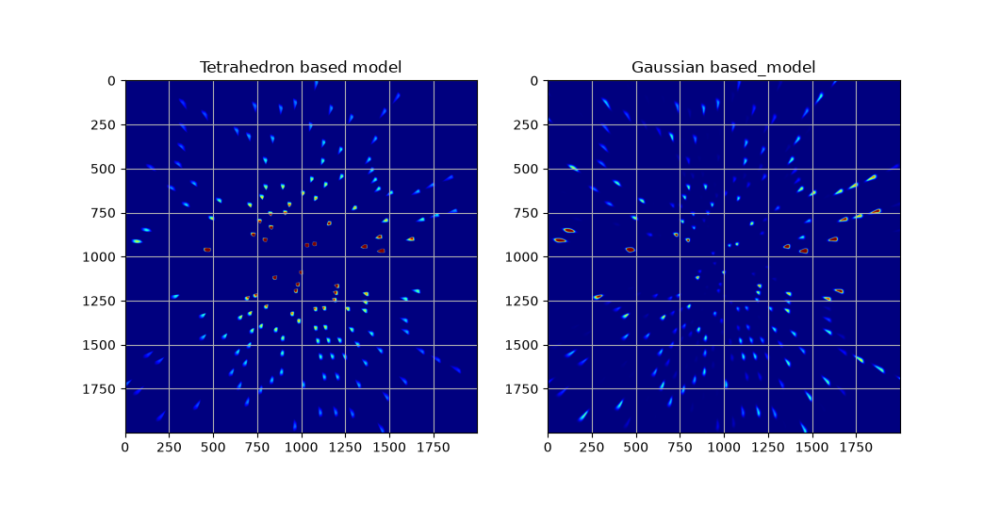

Gaussian models
===============

Gaussian splatting [Kerbl2023] is a quite trendy set of algorithms for modeling and rendering 3D scenes from a series of images with varying viewpoint.
Par of the appeal of these new methods is that the reconstructed scenes can be rendered very efficiently with a rasterization-approach.

We can model a polycrystal as a set of Gaussian subgrains, and under a set approximations, each such subgrain will cause a 2D-Gaussian gaussian-shaped
diffraction peak on the detector. The approach has been demonstrated and tested already in a serial-crystallography setting [Brehm2023].

There are a number of peak-broadedning effects that we could consider to include. As long as we assume that all of these have a Gaussian profile and are small enough that non-linear terms can be discarded, they will produce a Gaussian spot on the detector.

* Grain size
* Detector point-spread
* Incidident beam bandwidth
* Incident beam angular divergence
* lattice misorientation spread (aka. mosaicity)
* Strain-broadening (probably modeled by dislocation-concentrations and contrast factors)

To limit the scope here, I implement a model with grain-size and mosaicity only.

Scattering theory
-----------------

Given an incident beam descibed by some phase-space density, $p(\mathbf{k})$, centered on a point
$\mathbf{k}_0$ with length $k=2\pi/\lambda_0$. And given a crystallite with a "reciprocal space map" (RSM)
$f(\mathbf{q})$ around a specific reciprocal lattice vector $\mathbf{G}_0$. We want to compute 
the phase-space distribution of the scattered beam which is given by an integral:

$$
   I(\mathbf{p}) = \int \mathrm{d}\mathbf{k}\int \mathrm{d}\mathbf{q}
    p(\mathbf{k})f(\mathbf{q})\delta(|\mathbf{k}|-|\mathbf{p}|)\delta(\mathbf{k}+\mathbf{q}-\mathbf{p})
$$

the two delta-Dirac function ensure energy- and momentum conservation respectively. 

You can plug in various combinations of gaussians and delta-Dirac function in for 
the two functions and go to town, but for a little bit of extra phyical understanding we
introduce a specific choise of basis vectors.

$$
   \mathbf{k} = \mathbf{k}_0 + \varepsilon\hat{\mathbf{\mathbf{k}_0}}
    + \zeta_{||}\hat{\mathbf{k}_{||}}
     + \zeta_\perp\hat{\mathbf{k}_\perp}
$$

where hat denoes the normalized vector. $\hat{\mathbf{k}_{||}}$ is 
a vector orthogonal to 
$\mathbf{k}_0$ that lies in the span of 
$\mathbf{G}$ and 
$\mathbf{k}_0$ with the sign chosen such that 
$\mathbf{G}\cdot\hat{\mathbf{k}_{||}}>0$ . The last unit vector completes a right hand basis 
$\hat{\mathbf{k}_\perp}=\hat{\mathbf{k}_0}\times\hat{\mathbf{k}_{||}}$ .

We compute a nominal scattering vector $\theta_0=\arcsin(|\mathbf{G}_0|/2k)$ and

$$
   \mathbf{Q} = 2k\sin\theta_0[\cos\theta_0 \hat{\mathbf{k}_{||}} - \sin\theta_0\hat{\mathbf{k}_0}] = 2k\sin\theta_0\hat{\mathbf{Q}}
$$

Importantly this vector is not quite equal to $\mathbf{G}$ but should be close the difference
between the two is to first order parrallel to the unit-vector $\hat{\mathbf{q}}_{\mathrm{rock}} = [\cos\theta_0\hat{\mathbf{k}_0} + \sin\theta_0 \hat{\mathbf{k}_{||}}]$

which completes the basis for $\mathbf{q}$:

$$
   \mathbf{q} = \mathbf{G}_0 + q_{\mathrm{rock}}\hat{\mathbf{q}_{\mathrm{rock}}}
    + q_{\mathrm{strain}}\hat{\mathbf{Q}}
     + q_{\mathrm{roll}}\hat{\mathbf{k}_\perp} \\\\
     \approx \mathbf{Q} + (q_{\mathrm{rock}} - \delta q)\hat{\mathbf{q}_{\mathrm{rock}}}
      + q_{\mathrm{strain}}\hat{\mathbf{Q}}
       + q_{\mathrm{roll}}\hat{\mathbf{k}_\perp}
$$

where $\delta q = (\mathbf{Q} - \mathbf{G})\cdot\hat{\mathbf{q}_{\mathrm{rock}}}$ is a measure of how far the reflection is out of alignment. 

Now finally we can choose a parametrization of the outgoing ray. First we define $\mathbf{k}_h = \mathbf{k}_0 + \mathbf{Q}$
which by construction is equal to

 $$
 \mathbf{k}_h = k [\cos2\theta_0 \hat{\mathbf{k}_0} + \sin2\theta_0\hat{\mathbf{k}_{||}}]$$

Again we need to final unit vector normal to this: $\hat{\mathbf{k}_{\mathrm{up}}} = [\cos2\theta_0\hat{\mathbf{k}_{||}}-\sin2\theta_0 \hat{\mathbf{k}_0}]$.

$$
   \mathbf{p} = \mathbf{k}_h + \varepsilon'\hat{\mathbf{\mathbf{k}_h}}
    + \psi_{\mathrm{rad}}\hat{\mathbf{k}_{\mathrm{rad}}}
     + \psi_{\mathrm{azim}}\hat{\mathbf{k}_\perp}
$$

Assuming all deviations from the nominal directions are small, we see that $|\mathbf{k}|\approx k+\epsilon$ 
and $|\mathbf{p}|\approx k+\epsilon'$ so the energy-conservation integral can be raised by setting $\varepsilon = \varepsilon'$.

The momentum-conservation factor can be used to raise either the $\mathbf{k}$ or the $\mathbf{q}$ integral.

In either case, the equations enforced by momentum conservation is

$$
   \mathbf{q} = \mathbf{p} - \mathbf{k} \\\\
   \Leftrightarrow
    (q_{\mathrm{rock}} - \delta q)\hat{\mathbf{q}}_{\mathrm{rock}}
      + q_{\mathrm{strain}}\hat{\mathbf{Q}}
       + q_{\mathrm{roll}}\hat{\mathbf{k}_\perp}\\\\
       = 
    2\sin\theta_0 \varepsilon \hat{\mathbf{Q}}
    + \psi_{\mathrm{rad}}\hat{\mathbf{k}_{\mathrm{rad}}}
     + \psi_{\mathrm{azim}}\hat{\mathbf{k}_\perp}
      + \zeta_{||}\hat{\mathbf{k}_{||}}
       + \zeta_\perp\hat{\mathbf{k}_\perp}
$$    

In the current model, the incident beams is monochromatic and collimated ($\varepsilon = \zeta_{||} = \zeta_{\perp} = 0$) and there is no strain-broadening $q_{\mathrm{strain}}=0$ leading to a significant simplification:

$$
    (q_{\mathrm{rock}} - \delta q)\hat{\mathbf{q}_{\mathrm{rock}}}
       + q_{\mathrm{roll}}\hat{\mathbf{k}_\perp} = 
    + \psi_{\mathrm{rad}}\hat{\mathbf{k}_{\mathrm{rad}}}
     + \psi_{\mathrm{azim}}\hat{\mathbf{k}_\mathrm{rad}}
$$

which can be rearanged to the three scalar equations:

$$
    q_{\mathrm{roll}} = \psi_{\mathrm{azim}} \text{ and } q_{\mathrm{rock}} = \delta q \text{ and } \psi_{\mathrm{rad}}=0
$$

So the scattered beam is simply a 1D Gaussian that samples the RSM though a line offset by $\delta q$ from the center of the RSM.

Computing the RSM from an anisotropic Gaussian texture model
------------------------------------------------------------

Because Orientation Distribution Functions (ODFs) are defined in SO(3), our set-up of multivariate Gaussians and line-interals does not actually work. The approach we take here is to consider some narrow distribution of orientations $f(g)$ which is a real-valued function of orientations, $g$. The distribution is centered on some orientation $g_0$, and we will approximate orientation-space with it's tangent space on this point. Say we have some mapping from a general  orientation $g$ to a tangent-vector $\mathbf{r}$ such that:

$$
    g \approx R_{\mathbf{r}}g_0 = \begin{bmatrix}
1 & -r_z & r_y \\
r_z & 1 & -r_x \\
-r_y & r_x & 1 
\end{bmatrix} g_0
$$

The density function we will be working with is:

$$
    f(\mathbf{r}) = \frac{2}{\sqrt{\pi}}\sqrt{\det T}\exp\left( -\mathbf{r}^{\mathrm{T}}T\mathbf{r} \right)  
$$

The important result is the pair-correlation function (pole density) which gives the probability of finding a lattice direction, $\mathbf{h}$ in a given laboratory-space direction $\mathbf{y}$. Both unit-3-vectors. Normally this involves an integral over a circle of rotation in SO(3), but in our approximation we can replace it with an infinite integral in $\mathbf{r}$-space. Defining $\mathbf{p} = g_0\mathbf{h}$, one parametrization of this line is:

$$
    \mathbf{r}(\lambda) = \frac{\mathbf{p}\times\mathbf{y}}{\mathbf{p}\cdot\mathbf{y}} + \lambda \mathbf{p} = \mathbf{r}_0 + \lambda \mathbf{p}
$$

this allows us to evaluate the integral by plugging in, completing the square, and remembering the Gaussian integral. (excercise for reader...)

$$
    A(\mathbf{y}, \mathbf{p};f) = \int_{-\infty}^\infty f(\mathbf{r}(\lambda)) \mathrm{d}\lambda = \frac{2\sqrt{\det \mathrm{T}}}{\sqrt{\mathbf{p}^{\mathrm{T}}\mathrm{T}\mathbf{p}}}\exp\left( -\mathbf{r}_0^{\mathrm{T}}\mathrm{T}\mathbf{r}_0 + \frac{(\mathbf{r}_0^{\mathrm{T}}\mathrm{T}\mathbf{p})^2}{\mathbf{p}^{\mathrm{T}}\mathrm{T}\mathbf{p}} \right)
$$

Since this expression is anyways already only approximate, I make the further approximation: $\mathbf{p}\cdot\mathbf{y} \approx 1$ and rewrite:

$$
    A(\mathbf{y}, \mathbf{p};f) = \frac{2\sqrt{\det \mathrm{T}}}{\sqrt{\mathbf{p}^{\mathrm{T}}\mathrm{T}\mathbf{p}}}\exp\left( -\mathbf{y}^{\mathrm{T}}\mathrm{T}_{\mathbf{p}}\mathbf{y} \right)
$$

where $\mathrm{T}_{\mathbf{p}}$ is a 3-by-3 matrix with elements:

$$
    [\mathrm{T}_{\mathbf{p}}]_{ij} = p_k \varepsilon_{lki}(T_{lm}-T_{lp}p_pp_qT_{qm}/pTp)\varepsilon_{mnj}p_n
$$

where $pTp = \mathbf{p}^{\mathrm{T}}\mathrm{T}\mathbf{p}$ and $\varepsilon_{ijk}$ is the Levi-Civita symbol, used to move the cross-product in the definition of $\mathbf{r}_0$ into the definition of the projected tensor. When we don't deal with strain-broadedning, the pole-figure times a 1-D delta-Dirac function is identical to the RSM.

Testing
-------

I simulate a 1 degree rotation of a single crystal of quartz in the shape of a symmetric tetrahedron. The crystal is much larger than the pixels and  the largest scattering angles are over 90 degrees to see the perspective effect at large angles.

The gaussian simulation uses seven gaussians to approximate the tetragedron (on symmetric in the center and six prolate ones along the edges) and has low misorientation.

The position and shapes of the peaks match well. The gaussian model includes some extra weak peaks because it is integrating a gaussian shaped time-window where the tetrahedron model is integrating a top hat time window.

Potential improvements
----------------------

Include incident beam divergence and bandwidth.

Improve performance of the rasterizer.

### References

[Kerbl2023] Bernhard Kerbl, Georgios Kopanas, Thomas Leimkuehler, and George Drettakis. 3d gaussian splatting for real-time radiance field rendering, 2023.

[Brehm2023] Brehm, W., White, T. & Chapman, H. N. (2023). Crystal diffraction prediction and partiality estimation using Gaussian basis functions. Acta Cryst. A79