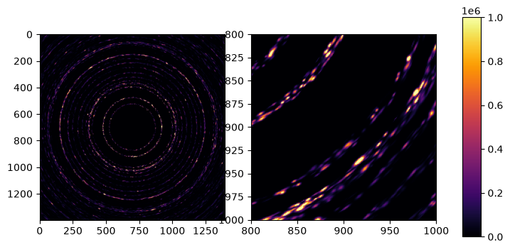

Gaussian models
===============

Gaussian splatting [Kerbl2023] is a quite trendy set of algorithms for modeling and rendering 3D scenes from a series of images with varying viewpoint. Part of the appeal of these new methods is that the reconstructed scenes can be rendered very quickly with a rasterization-approach.

We can model a polycrystal as a set of Gaussian subgrains, and under a certain set approximations, each such subgrain will cause a 2D-Gaussian gaussian-shaped diffraction peak on the detector. Part of the approach has been demonstrated and tested already in a serial-crystallography setting [Brehm2023] which I'm borrowing some ideas from.

There are a number of peak-broadedning effects that we could consider to include. As long as we assume that all of these have a Gaussian profile and are small enough that non-linear terms can be discarded, they will produce a Gaussian spot on the detector.

* Grain size
* Detector point-spread
* Incident beam bandwidth
* Incident beam angular divergence
* Lattice misorientation (mosaicity)
* Strain-broadening 

To limit the scope here, I implement a model with grain-size and mosaicity only.

Scattering theory
-----------------

Given an incident beam descibed by some phase-space density, $p(\mathbf{k})$, centered on a vector $\mathbf{k}_0$ with magnitude $k=2\pi/\lambda_0$. And given a crystallite with a "reciprocal space map" (RSM) $f(\mathbf{q})$ around a specific reciprocal lattice vector $`\mathbf{G}_0`$. We want to compute 
the phase-space distribution of the scattered beam which is given by an integral:

$$
   I(\mathbf{p}) = \int \mathrm{d}\mathbf{k}\int \mathrm{d}\mathbf{q}
    p(\mathbf{k})f(\mathbf{q})\delta(|\mathbf{k}|-|\mathbf{p}|)\delta(\mathbf{k}+\mathbf{q}-\mathbf{p})
$$

the two delta-Dirac functions ensure energy- and momentum conservation respectively. 

You can plug in various combinations of gaussians and delta-Dirac function in for the two functions and go to town, but following [Poulsen2018] we introduce a specific set of basis vector for the integration variables.

$$
   \mathbf{k} = \mathbf{k}_0 + k\left(\varepsilon\hat{\mathbf{\mathbf{k}_0}}
    + \zeta_{||}\hat{\mathbf{k}_{||}}
     + \zeta_\perp\hat{\mathbf{k}_\perp}\right)
$$

where hat denoes the normalized vector. $`\hat{\mathbf{k}_{||}}`$ is 
a vector orthogonal to $`\mathbf{k}_0`$ that lies in the span of $`\mathbf{G}`$ and $`\mathbf{k}_0`$ with the sign chosen such that $`\mathbf{G}\cdot\hat{\mathbf{k}_{||}}>0`$ . The last unit vector completes a right hand basis $`\hat{\mathbf{k}_\perp}=\hat{\mathbf{k}_0}\times\hat{\mathbf{k}_{||}}`$ .

We compute a nominal scattering vector $\theta_0=\arcsin(|\mathbf{G}_0|/2k)$ and

$$
   \mathbf{Q} = 2k\sin\theta_0[\cos\theta_0 \hat{\mathbf{k}_{||}} - \sin\theta_0\hat{\mathbf{k}_0}] = 2k\sin\theta_0\hat{\mathbf{Q}}
$$

This vector is only equal to the reciprocal lattice vector $\mathbf{G}$ crystallite is perfectly aligned. For small deviations, the difference between the two is parrallel to the unit-vector $`\hat{\mathbf{q}}_{\mathrm{rock}} = [\cos\theta_0\hat{\mathbf{k}_0} + \sin\theta_0 \hat{\mathbf{k}_{||}}]`$

which completes the basis for $\mathbf{q}$:

$$
   \mathbf{q} = \mathbf{G}_0 + 2k\sin\theta_0\left(q_{\mathrm{rock}}\hat{\mathbf{q}_{\mathrm{rock}}}
    + q_{\mathrm{strain}}\hat{\mathbf{Q}}
     + q_{\mathrm{roll}}\hat{\mathbf{k}_\perp}\right) \\\\
     \approx \mathbf{Q} + 2k\sin\theta_0\left((q_{\mathrm{rock}} - \delta q)\hat{\mathbf{q}_{\mathrm{rock}}}
      + q_{\mathrm{strain}}\hat{\mathbf{Q}}
       + q_{\mathrm{roll}}\hat{\mathbf{k}_\perp}\right)
$$

where $\delta q = 1/(2k\sin\theta_0)(\mathbf{Q} - \mathbf{G})\cdot\hat{\mathbf{q}_{\mathrm{rock}}}$ is a measure of how far the reflection is out of alignment. 

The coordinates $`[\varepsilon, \zeta_{||}, \zeta_\perp]`$ and $`[q_{\mathrm{rock}}, q_{\mathrm{strain}}, q_{\mathrm{roll}}]`$ are a natural choice for integration variables as they allow sepparating, energy, collimation, misoientation, and strain-effects.

We can also choose coordinates for the outgoing ray. First we define the nominal scattered wavevector

$$
    \mathbf{k}_h = \mathbf{k}_0 + \mathbf{Q} = k [\cos2\theta_0 \hat{\mathbf{k}_0} + \sin2\theta_0\hat{\mathbf{k}_{||}}]
$$

and a unit vector normal to this: $`\hat{\mathbf{k}_{\mathrm{rad}}} = [\cos2\theta_0\hat{\mathbf{k}_{||}}-\sin2\theta_0 \hat{\mathbf{k}_0}]`$ so we can write.

$$
   \mathbf{p} = \mathbf{k}_h + k\left(\varepsilon'\hat{\mathbf{\mathbf{k}_h}}
    + \psi_{\mathrm{rad}}\hat{\mathbf{k}_{\mathrm{rad}}}
     + \psi_{\mathrm{azim}}\hat{\mathbf{k}_\perp}\right)
$$

Assuming all deviations from the nominal directions are small, we see that $|\mathbf{k}|\approx k(1+\epsilon)$ 
and $|\mathbf{p}|\approx k(1+\epsilon')$ so the energy integral can be raised by setting $\varepsilon = \varepsilon'$.

The momentum-conservation factor can be used to raise either the $\mathbf{k}$ or the $\mathbf{q}$ integral.

In either case, the equations enforced by momentum conservation is

$$
   \mathbf{q} = \mathbf{p} - \mathbf{k} \\\\
   \Leftrightarrow
    2\sin\theta_0\left[(q_{\mathrm{rock}} - \delta q)\hat{\mathbf{q}}_{\mathrm{rock}}
      + q_{\mathrm{strain}}\hat{\mathbf{Q}}
       + q_{\mathrm{roll}}\hat{\mathbf{k}_\perp}\right]\\\\
       = 
    2\sin\theta_0 \varepsilon \hat{\mathbf{Q}}
    + \psi_{\mathrm{rad}}\hat{\mathbf{k}_{\mathrm{rad}}}
     + \psi_{\mathrm{azim}}\hat{\mathbf{k}_\perp}
      + \zeta_{||}\hat{\mathbf{k}_{||}}
       + \zeta_\perp\hat{\mathbf{k}_\perp}
$$    

In the current model, the incident beam is monochromatic and collimated ($\varepsilon = \zeta_{||} = \zeta_{\perp} = 0$) and there is no strain-broadening $q_{\mathrm{strain}}=0$ leading to:

$$
    (q_{\mathrm{rock}} - \delta q)\hat{\mathbf{q}_{\mathrm{rock}}}
       + q_{\mathrm{roll}}\hat{\mathbf{k}_\perp} = 
    \psi_{\mathrm{rad}}\hat{\mathbf{k}_{\mathrm{rad}}}
     + \psi_{\mathrm{azim}}\hat{\mathbf{k}_\mathrm{azim}}
$$

which can be rearanged to the three coordinate equations:

$$
    q_{\mathrm{roll}} = \psi_{\mathrm{azim}} \text{ and } q_{\mathrm{rock}} = \delta q \text{ and } \psi_{\mathrm{rad}}=0
$$

So the scattered beam is simply a 1D Gaussian that samples the RSM though a line offset by $\delta q$ from the center of the RSM.

Computing the RSM from an anisotropic Gaussian texture model
------------------------------------------------------------

The approach we take here is to consider some narrow distribution of orientations $f(g)$ which is a real-valued function of orientation, $g$. The distribution is centered on some orientation $g_0$, and we will approximate orientation-space with it's tangent space on this point. Say we have some mapping from a general  orientation $g$ to a tangent-vector $\mathbf{r}$ such that:

$$
    g \approx R_{\mathbf{r}}g_0 = \begin{bmatrix}
1 & -r_z & r_y \\
r_z & 1 & -r_x \\
-r_y & r_x & 1 
\end{bmatrix} g_0
$$

The density function we will be working with is:

$$
    f(\mathbf{r}) = \frac{2}{\sqrt{\pi}}\sqrt{\det T}\exp\left( -\mathbf{r}^{\mathrm{T}}T\mathbf{r} \right)  
$$

The quantity we need is the pair-correlation function (pole density) which gives the probability of finding a lattice direction, $`\mathbf{h} = \mathbf{B}_0[h, k, \ell]^{\mathrm{T}}/|\mathbf{B}_0[h, k, \ell]^{\mathrm{T}}|`$ in a given laboratory-space direction $\mathbf{y} = \hat{\mathbf{q}}$. Normally this involves an integral over a circle in SO(3), but in our approximation we can replace it with an infinite line integral in the tangent-space. Defining $\mathbf{p} = g_0\mathbf{h}=\hat{G}$, one parametrization of this line is:

$$
    \mathbf{r}(\lambda) = \frac{\mathbf{p}\times\mathbf{y}}{\mathbf{p}\cdot\mathbf{y}} + \lambda \mathbf{p} = \mathbf{r}_0 + \lambda \mathbf{p}
$$

this allows us to evaluate the integral by plugging in, completing the square, and remembering the Gaussian integral. (excercise for reader...)

$$
    A(\mathbf{y}, \mathbf{p};f) = \int_{-\infty}^\infty f(\mathbf{r}(\lambda)) \mathrm{d}\lambda = \frac{2\sqrt{\det \mathrm{T}}}{\sqrt{\mathbf{p}^{\mathrm{T}}\mathrm{T}\mathbf{p}}}\exp\left( -\mathbf{r}_0^{\mathrm{T}}\mathrm{T}\mathbf{r}_0 + \frac{(\mathbf{r}_0^{\mathrm{T}}\mathrm{T}\mathbf{p})^2}{\mathbf{p}^{\mathrm{T}}\mathrm{T}\mathbf{p}} \right)
$$

Since this expression is anyways already only approximate, I make the further approximation: $\mathbf{p}\cdot\mathbf{y} \approx 1$ and rewrite:

$$
    A(\mathbf{y}, \mathbf{p};f) = \frac{2\sqrt{\det \mathrm{T}}}{\sqrt{\mathbf{p}^{\mathrm{T}}\mathrm{T}\mathbf{p}}}\exp\left( -\mathbf{y}^{\mathrm{T}}\mathrm{T}_{\mathbf{p}}\mathbf{y} \right)
$$

where $\mathrm{T}_{\mathbf{p}}$ is a 3-by-3 matrix with elements:

$$
    [\mathrm{T}_{\mathbf{p}}]_{ij} = p_k \varepsilon_{lki}(T_{lm}-T_{lp}p_pp_qT_{qm}/pTp)\varepsilon_{mnj}p_n
$$

where $pTp = \mathbf{p}^{\mathrm{T}}\mathrm{T}\mathbf{p}$ and $\varepsilon_{ijk}$ is the Levi-Civita symbol, used to move the cross-product in the definition of $\mathbf{r}_0$ into the definition of the projected tensor.

This function is defined for unit-vectors arguments, but we can upgrade it to a 3D RSM which is only non-zero on a 2D plane:

$$
    f(\mathbf{q}) \approx \delta(q_{\mathrm{strain}})\frac{2\sqrt{\det \mathrm{T}}}{\sqrt{\mathbf{p}^{\mathrm{T}}\mathrm{T}\mathbf{p}}}\exp\left( -[q_{\mathrm{rock}}, q_{\mathrm{roll}}][\hat{\mathbf{q}}_{\mathrm{rock}}, \hat{\mathbf{k}}_\perp]^\mathrm{T}\mathrm{T}_{\mathbf{p}}[\hat{\mathbf{q}}_{\mathrm{rock}}, \hat{\mathbf{k}}_\perp][q_{\mathrm{rock}}, q_{\mathrm{roll}}]^{\mathrm{T}} \right) $$

Testing
-------

I simulate a 1 degree rotation of a single crystal of quartz in the shape of a symmetric tetrahedron. The crystal is much larger than the pixels and  the largest scattering angles are over 90 degrees to see the perspective effect at large angles.

The gaussian simulation uses seven gaussians to approximate the tetrahedron (one symmetric gaussian in the center and six prolate ones along the edges) and has low misorientation.

The position and shapes of the peaks match well. The gaussian model includes some extra weak peaks because it is integrating a gaussian shaped time-window where the tetrahedron model is integrating a top hat time window.

I also simulate the example from the main documentation, but with a reduced number of grains (~4000 gaussians and 10 000 000 reflections) which takes about 3 minutes to render on my laptop.

The resulting diffraction images look quite realistic.

Potential improvements
----------------------

**Include incident beam divergence and bandwidth.**

For lab-instruments these are the dominant factors that determine reflection widths, rather than mosaicity. They also only add a very small amount of model complexity. The issue is numerical stability and actually just stitting down and evaluating the integrals.

**Improve performance of the rasterizer.**

About 97.5 percent of the computation time is spent in the very simple function `detector._render_gaussian_splats`. Which simply renderes a set of 2D gaussians onto a pixel map. It must be possible to speed this up by checking for inclusion in a better way.

### References

[Kerbl2023] Bernhard Kerbl, Georgios Kopanas, Thomas Leimkuehler, and George Drettakis. 3d gaussian splatting for real-time radiance field rendering, 2023.

[Brehm2023] Brehm, W., White, T. & Chapman, H. N. (2023). Crystal diffraction prediction and partiality estimation using Gaussian basis functions. Acta Cryst. A79

[Poulsen2018] Poulsen, H. F., Jakobsen, A. C., Simons, H., Ahl, S. R., Cook, P. K. & Detlefs, C. (2017). X-ray diffraction microscopy based on refractive optics. J. Appl. Cryst. 50

WorkInProgress: Model with beam divergence
------------------------------------------

We are not interested in the energy of the outgoing beam, so we integrate out $`\varepsilon`$ and we still set strain-broadening to zero.

We isolate the incident beam variables in the momentum conservation equation:

$$
   \varepsilon = \frac{1}{\sin\theta_0}\psi_{\mathrm{rad}}-\tan\theta_0(q_{\mathrm{rock}}-\delta q) \\\\
   \zeta_{||} = -\psi_{\mathrm{rad}} - 2(q_{\mathrm{rock}}-\delta q) \\\\
   \zeta_\perp = \psi_{\mathrm{azim}} - 2\sin\theta_0q_{\mathrm{roll}}
$$

Now $`q_{\mathrm{rock}}`$ and $`q_{\mathrm{roll}}`$ are the integration variables. 

$$
   \int \mathrm{d}\varepsilon  I(\mathbf{p}) = \int \mathrm{d}q_{\mathrm{rock}}\int \mathrm{d}q_{\mathrm{roll}} \exp\Bigg[ -\mathrm{E}\left(\frac{1}{\sin\theta_0}\psi_{\mathrm{rad}}-\tan\theta_0(q_{\mathrm{rock}}-\delta q)\right)^2 \\\\
    -[-\psi_{\mathrm{rad}} - 2(q_{\mathrm{rock}}-\delta q), \psi_{\mathrm{azim}} - 2\sin\theta_0q_{\mathrm{roll}}]^{\mathrm{T}}[\hat{\mathbf{k}}_{||}, \hat{\mathbf{k}}_\perp]^{\mathrm{T}}\mathrm{D}[\hat{\mathbf{k}}_{||}, \hat{\mathbf{k}}_\perp][-\psi_{\mathrm{rad}} - 2(q_{\mathrm{rock}}-\delta q), \psi_{\mathrm{azim}} - 2\sin\theta_0q_{\mathrm{roll}}] \left) \right)\\\\
    -[q_{\mathrm{rock}}, q_{\mathrm{roll}}][\hat{\mathbf{q}}_{\mathrm{rock}}, \hat{\mathbf{k}}_\perp]^\mathrm{T}\mathrm{T}_{\mathbf{p}}[\hat{\mathbf{q}}_{\mathrm{rock}}, \hat{\mathbf{k}}_\perp][q_{\mathrm{rock}}, q_{\mathrm{roll}}]^{\mathrm{T}}
    \Bigg]
$$

where $`\mathrm{E}`$ is one over the bandwidth squared, and $`\mathrm{D}`$ is a tensor describing the divergence of the beam. We want to rewrite this as a 2D Gaussian in $`\psi_{\mathrm{rad}}`$ and $\psi_{\mathrm{azim}}$.

Steps are as follows:

**Collect terms that depend on the integration variables squared.**

$$
A = \begin{bmatrix}
    E\tan^2\theta_0 & 0 \\
    0 & 0
\end{bmatrix} + 
\begin{bmatrix} 2 & 0\\
0 & 2\sin\theta_0
\end{bmatrix}^{\mathrm{T}}
\begin{bmatrix} \hat{\mathbf{k}}_{||}^{\mathrm{T}}\mathrm{D}\hat{\mathbf{k}}_{||} & \hat{\mathbf{k}}_\perp^{\mathrm{T}}\mathrm{D}\hat{\mathbf{k}}_{||} \\
\hat{\mathbf{k}}_{||}^{\mathrm{T}}\mathrm{D}\hat{\mathbf{k}}_\perp & \hat{\mathbf{k}}_\perp^{\mathrm{T}}\mathrm{D}\hat{\mathbf{k}}_\perp \\
\end{bmatrix}
\begin{bmatrix} 2 & 0\\
0 & 2\sin\theta_0
\end{bmatrix} +
\begin{bmatrix}
    \hat{\mathbf{k}}_{||}^{\mathrm{T}}\mathrm{T}_{\mathbf{p}}\hat{\mathbf{k}}_{||} & \hat{\mathbf{k}}_{||}^{\mathrm{T}}\mathrm{T}_{\mathbf{p}}\hat{\mathbf{k}}_\perp \\
    \hat{\mathbf{k}}_\perp^{\mathrm{T}}\mathrm{T}_{\mathbf{p}}\hat{\mathbf{k}}_{||} & \hat{\mathbf{k}}_\perp^{\mathrm{T}}\mathrm{T}_{\mathbf{p}}\hat{\mathbf{k}}_\perp
\end{bmatrix}
$$

**And linear**

$$
B = \begin{bmatrix}
    E\tan\theta_0(1/\sin\theta_0\psi_{\mathrm{rad}} + \tan\theta_0\delta q)\\
0
\end{bmatrix} +
\begin{bmatrix} -\left(\psi_{\mathrm{rad}} + 2\delta q\right) \\
\psi_{\mathrm{azim}}
\end{bmatrix}^{\mathrm{T}}
\begin{bmatrix} \hat{\mathbf{k}}_{||}^{\mathrm{T}}\mathrm{D}\hat{\mathbf{k}}_{||} & \hat{\mathbf{k}}_\perp^{\mathrm{T}}\mathrm{D}\hat{\mathbf{k}}_{||} \\
\hat{\mathbf{k}}_{||}^{\mathrm{T}}\mathrm{D}\hat{\mathbf{k}}_\perp & \hat{\mathbf{k}}_\perp^{\mathrm{T}}\mathrm{D}\hat{\mathbf{k}}_\perp \\
\end{bmatrix}
\begin{bmatrix} 2 & 0\\
0 & 2\sin\theta_0
\end{bmatrix}
$$

**And everything else**

$$
C = -E\left(\frac{1}{\sin\theta_0}\psi + \tan\theta_0\delta q\right)^2 - \begin{bmatrix} -\left(\psi_{\mathrm{rad}} + 2\delta q\right) \\
\psi_{\mathrm{azim}}
\end{bmatrix}^{\mathrm{T}}\begin{bmatrix} \hat{\mathbf{k}}_{||}^{\mathrm{T}}\mathrm{D}\hat{\mathbf{k}}_{||} & \hat{\mathbf{k}}_\perp^{\mathrm{T}}\mathrm{D}\hat{\mathbf{k}}_{||} \\
\hat{\mathbf{k}}_{||}^{\mathrm{T}}\mathrm{D}\hat{\mathbf{k}}_\perp & \hat{\mathbf{k}}_\perp^{\mathrm{T}}\mathrm{D}\hat{\mathbf{k}}_\perp \\
\end{bmatrix}
\begin{bmatrix} -\left(\psi_{\mathrm{rad}} + 2\delta q\right) \\
\psi_{\mathrm{azim}}
\end{bmatrix} 
$$

Now the integral is on a form we can deal with.

$$
   \int \mathrm{d}\varepsilon  I(\mathbf{p}) = \int \mathrm{d}\mathbf{q'} \exp\Bigg[ -\mathbf{q'}^{\mathrm{T}}A\mathbf{q'}^{\mathrm{T}} + 2 B^{\mathrm{T}}\mathbf{q'} + C
    \Bigg] = \frac{1}{(\det\mathrm{A})^{1/2}}\exp\left[C - B^{\mathrm{T}} A^{-1} B\right]
$$

**Then do the whole excercise again with the dependent variables**

This might need a computer algebra system... 
