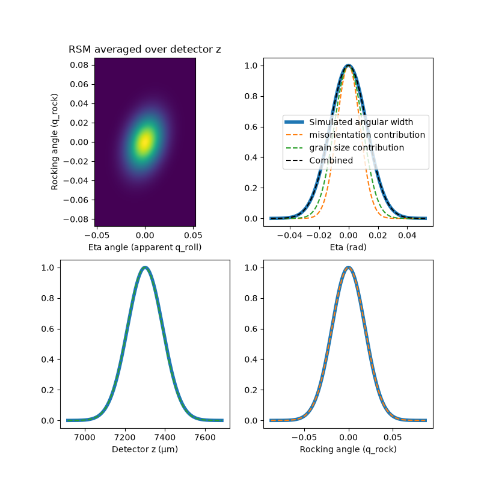
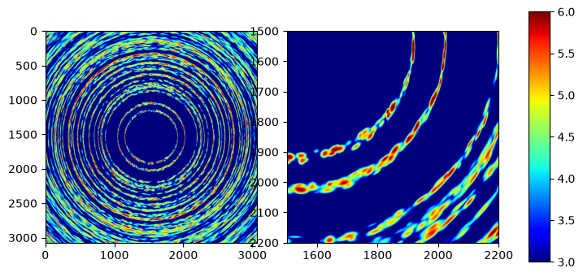

Gaussian models
===============

https://github.com/user-attachments/assets/534a0ea2-f01e-4928-a6dd-93d50e0fbd23


Gaussian splatting [Kerbl2023] is a quite trendy set of algorithms for modeling and rendering 3D scenes from a series of images with varying viewpoint. Part of the appeal of this method is that the reconstructed scenes can be rendered very quickly with a rasterization-approach.

We can model a polycrystal as a set of Gaussian grains/subgrains that have a gaussian density profile in real space and a mosaic spread of lattice orientation also descibed by a gaussian function. Under a certain set of approximations, each such subgrain will cause a gaussian shaped diffraction peak on the detector. Part of the approach has been demonstrated and tested already in a serial-crystallography setting by [Brehm2023].

There are a number of peak-broadedning effects that we could choose to include in the model. As long as we assume that all of these have a Gaussian profile and are small enough that non-linear terms can be discarded, they will produce a Gaussian spot on the detector.

* Grain size
* Detector point-spread
* Incident beam bandwidth
* Incident beam angular divergence
* Lattice misorientation (mosaicity)
* Strain-broadening 

Currently, we only implement a model with grain-size and mosaicity.

Scattering theory
-----------------

Given an incident x-ray beam descibed by some phase-space density, $p(\mathbf{k})$, centered on a vector $\mathbf{k}_0$ with magnitude $k=2\pi/\lambda_0$ and given a subgrain with a "reciprocal space map" (RSM) $f(\mathbf{q})$ around a specific reciprocal lattice vector $`\mathbf{G}_0`$, we want to compute the phase-space distribution of the scattered beam which is given by an integral:

$$
   I(\mathbf{p}) = \int \mathrm{d}\mathbf{k}\int \mathrm{d}\mathbf{q}
    p(\mathbf{k})f(\mathbf{q})\delta(|\mathbf{k}|-|\mathbf{p}|)\delta(\mathbf{k}+\mathbf{q}-\mathbf{p})
$$

the two delta-Dirac functions ensure energy- and momentum conservation respectively. 

You can plug in various combinations of gaussians and delta-Dirac function in for the two functions and go to town, but following [Poulsen2017] we introduce a specific set of basis vector for the integration variables.

$$
   \mathbf{k} = \mathbf{k}_0 + k\left(\varepsilon\hat{\mathbf{\mathbf{k}_0}}
    + \zeta_{||}\hat{\mathbf{k}_{||}}
     + \zeta_\perp\hat{\mathbf{k}_\perp}\right)
$$

where hat denoes the normalized vector. $`\hat{\mathbf{k}_{||}}`$ is 
a vector orthogonal to $`\mathbf{k}_0`$ that lies in the span of $`\mathbf{G}`$ and $`\mathbf{k}_0`$ with the sign chosen such that $`\mathbf{G}\cdot\hat{\mathbf{k}_{||}}>0`$ . The last unit vector completes a right hand basis $`\hat{\mathbf{k}_\perp}=\hat{\mathbf{k}_0}\times\hat{\mathbf{k}_{||}}`$ .

We define a nominal scattering vector $\theta_0=\arcsin(|\mathbf{G}_0|/2k)$ and

$$
   \mathbf{Q} = 2k\sin\theta_0[\cos\theta_0 \hat{\mathbf{k}_{||}} - \sin\theta_0\hat{\mathbf{k}_0}] = 2k\sin\theta_0\hat{\mathbf{Q}}
$$

The two vectors $\mathbf{G}_0$ and $\mathbf{Q}$ are only equal when the subgrain at hand is perfectly aligned. For small deviations, the difference between the two is parrallel to the unit-vector $`\hat{\mathbf{q}}_{\mathrm{rock}} = \cos\theta_0\hat{\mathbf{k}_0} + \sin\theta_0 \hat{\mathbf{k}_{||}}`$. This vector completes the basis for $\mathbf{q}$ which can be written:

$$
   \mathbf{q} = \mathbf{G}_0 + 2k\sin\theta_0\left(q_{\mathrm{rock}}\hat{\mathbf{q}_{\mathrm{rock}}}
    + q_{\mathrm{strain}}\hat{\mathbf{Q}}
     + q_{\mathrm{roll}}\hat{\mathbf{k}_\perp}\right) \\\\
     \approx \mathbf{Q} + 2k\sin\theta_0\left((q_{\mathrm{rock}} - \delta q)\hat{\mathbf{q}_{\mathrm{rock}}}
      + q_{\mathrm{strain}}\hat{\mathbf{Q}}
       + q_{\mathrm{roll}}\hat{\mathbf{k}_\perp}\right)
$$


where $\delta q = 1/(2k\sin\theta_0)(\mathbf{Q} - \mathbf{G})\cdot\hat{\mathbf{q}_{\mathrm{rock}}}$ is a measure of how far the reflection is out of alignment. It's equal to the so called "rocking angle" to first order.

The coordinates $`[\varepsilon, \zeta_{||}, \zeta_\perp]`$ and $`[q_{\mathrm{rock}}, q_{\mathrm{strain}}, q_{\mathrm{roll}}]`$ are a natural choice for integration variables as they allow sepparating, energy, collimation, misoientation, and strain-effects. To finish the syntax, we also choose coordinates for the outgoing ray. First we define the nominal scattered wavevector

$$
    \mathbf{k}_h = \mathbf{k}_0 + \mathbf{Q} = k [\cos2\theta_0 \hat{\mathbf{k}_0} + \sin2\theta_0\hat{\mathbf{k}_{||}}]
$$

and a unit vector normal to this: $`\hat{\mathbf{k}_{\mathrm{rad}}} = [\cos2\theta_0\hat{\mathbf{k}_{||}}-\sin2\theta_0 \hat{\mathbf{k}_0}]`$ so we can write.

$$
   \mathbf{p} = \mathbf{k}_h + k\left(\varepsilon'\hat{\mathbf{\mathbf{k}_h}}
    + \psi_{\mathrm{rad}}\hat{\mathbf{k}_{\mathrm{rad}}}
     + \psi_{\mathrm{azim}}\hat{\mathbf{k}_\perp}\right)
$$

Assuming all deviations from the nominal directions are small, we see that $|\mathbf{k}|\approx k(1+\epsilon)$ 
and $|\mathbf{p}|\approx k(1+\epsilon')$ so the energy integral can be raised by setting $\varepsilon = \varepsilon'$.

The momentum-conservation factor can be used to raise either the $\mathbf{k}$ or the $\mathbf{q}$ integral.

In either case, the equations enforced by momentum conservation is

$$
   \mathbf{q} = \mathbf{p} - \mathbf{k} \\\\
   \Leftrightarrow
    2\sin\theta_0\left[(q_{\mathrm{rock}} - \delta q)\hat{\mathbf{q}}_{\mathrm{rock}}
      + q_{\mathrm{strain}}\hat{\mathbf{Q}}
       + q_{\mathrm{roll}}\hat{\mathbf{k}_\perp}\right]\\\\
       = 
    2\sin\theta_0 \varepsilon \hat{\mathbf{Q}}
    + \psi_{\mathrm{rad}}\hat{\mathbf{k}_{\mathrm{rad}}}
     + \psi_{\mathrm{azim}}\hat{\mathbf{k}_\perp}
      + \zeta_{||}\hat{\mathbf{k}_{||}}
       + \zeta_\perp\hat{\mathbf{k}_\perp}
$$    


In the current model, the incident beam is monochromatic and collimated ($\varepsilon = \zeta_{||} = \zeta_{\perp} = 0$) and there is no strain-broadening $q_{\mathrm{strain}}=0$ leading to:

$$
    2\sin\theta_0[(q_{\mathrm{rock}} - \delta q)\hat{\mathbf{q}_{\mathrm{rock}}}
       + q_{\mathrm{roll}}\hat{\mathbf{k}_\perp}] = 
    \psi_{\mathrm{rad}}\hat{\mathbf{k}_{\mathrm{rad}}}
     + \psi_{\mathrm{azim}}\hat{\mathbf{k}_\mathrm{\perp}}
$$

which can be rearanged to the three coordinate equations:

$$
    2\sin\theta_0 q_{\mathrm{roll}} = \psi_{\mathrm{azim}} \text{ and } q_{\mathrm{rock}} = \delta q \text{ and } \psi_{\mathrm{rad}}=0
$$


So the scattered beam is simply a 1D Gaussian that samples the RSM though a line parallel to $\hat{\mathbf{k}}_\perp$ offset by $\delta q$ from the center of the RSM.

Computing the RSM from an anisotropic Gaussian texture model
------------------------------------------------------------

The approach we take here is to consider some narrow distribution of orientations $f(g)$ which is a real-valued function of orientation, $g$. The distribution is centered on some orientation $g_0$, and we will approximate orientation-space with it's tangent space on this point. Say we have some mapping from a general  orientation $g$ to a tangent-vector $\mathbf{r}$ such that:

$$
    g \approx R_{\mathbf{r}}g_0 = \begin{bmatrix}
1 & -r_z & r_y \\
r_z & 1 & -r_x \\
-r_y & r_x & 1 
\end{bmatrix} g_0
$$

The density function we will be working with is:

$$
    f(\mathbf{r}) = \frac{2}{\sqrt{\pi}}\sqrt{\det T}\exp\left( -\mathbf{r}^{\mathrm{T}}T\mathbf{r} \right)  
$$

The quantity we need is the pair-correlation function (pole density) which gives the probability of finding a lattice direction, $`\mathbf{h} = \mathbf{B}_0[h, k, \ell]^{\mathrm{T}}/|\mathbf{B}_0[h, k, \ell]^{\mathrm{T}}|`$ in a given laboratory-space direction $\mathbf{y}$.

 (In the notation of last section $\mathbf{h} || \mathbf{G}$ and $\mathbf{y} || \mathbf{q}$. The notation used here is conventional in texture-analysis. Note: $\mathbf{y}$ has nothing to do with "the y-axis".)
 
  Normally this involves an integral over a circle in SO(3), but in our approximation we can replace it with an infinite line integral in the tangent-space. Defining $\mathbf{p} = g_0\mathbf{h}=\hat{G}$, one parametrization of this line is:

$$
    \mathbf{r}(\lambda) = \frac{\mathbf{p}\times\mathbf{y}}{\mathbf{p}\cdot\mathbf{y}} + \lambda \mathbf{p} = \mathbf{r}_0 + \lambda \mathbf{p}
$$

this allows us to evaluate the integral by plugging in, completing the square, and evaluating a Gaussian integral. (excercise left for reader)

$$
    A(\mathbf{y}, \mathbf{p};f) = \int_{-\infty}^\infty f(\mathbf{r}(\lambda)) \mathrm{d}\lambda = \frac{2\sqrt{\det \mathrm{T}}}{\sqrt{\mathbf{p}^{\mathrm{T}}\mathrm{T}\mathbf{p}}}\exp\left( -\mathbf{r}_0^{\mathrm{T}}\mathrm{T}\mathbf{r}_0 + \frac{(\mathbf{r}_0^{\mathrm{T}}\mathrm{T}\mathbf{p})^2}{\mathbf{p}^{\mathrm{T}}\mathrm{T}\mathbf{p}} \right)
$$

Since this expression is already approximate, I make the further approximation: $\mathbf{p}\cdot\mathbf{y} \approx 1$ and rewrite:

$$
    A(\mathbf{y}, \mathbf{p};f) = \frac{2\sqrt{\det \mathrm{T}}}{\sqrt{\mathbf{p}^{\mathrm{T}}\mathrm{T}\mathbf{p}}}\exp\left( -\mathbf{y}^{\mathrm{T}}\mathrm{T}_{\mathbf{p}}\mathbf{y} \right)
$$

where $\mathrm{T}_{\mathbf{p}}$ is a 3-by-3 matrix with elements:

$$
    [\mathrm{T}_{\mathbf{p}}]_{ij} = p_k \varepsilon_{lki}(T_{lm}-T_{lp}p_pp_qT_{qm}/pTp)\varepsilon_{mnj}p_n
$$

where $pTp = \mathbf{p}^{\mathrm{T}}\mathrm{T}\mathbf{p}$ and $\varepsilon_{ijk}$ is the Levi-Civita symbol which is simply used to move the cross-product in the definition of $\mathbf{r}_0$ into the definition of the projected tensor, to make future expressions nicer.

This function is defined for unit-vector arguments, but we can upgrade it to a 3D RSM which is only non-zero on a 2D plane. Here given in the nice coordinates of last section:

$$
    f(\mathbf{q}) \approx \delta(q_{\mathrm{strain}})\frac{2\sqrt{\det \mathrm{T}}}{\sqrt{\mathbf{p}^{\mathrm{T}}\mathrm{T}\mathbf{p}}}\exp\left( -[q_{\mathrm{rock}}, q_{\mathrm{roll}}][\hat{\mathbf{q}}_{\mathrm{rock}}, \hat{\mathbf{k}}_\perp]^\mathrm{T}\mathrm{T}_{\mathbf{p}}[\hat{\mathbf{q}}_{\mathrm{rock}}, \hat{\mathbf{k}}_\perp][q_{\mathrm{rock}}, q_{\mathrm{roll}}]^{\mathrm{T}} \right)
$$

Testing
-------

I simulate a 1 degree rotation of a single crystal of quartz in the shape of a symmetric tetrahedron. The crystal is much larger than the pixels and  the largest scattering angles are over 90 degrees to see the perspective effect at large angles.

The gaussian simulation uses seven gaussians to approximate the tetrahedron (one symmetric gaussian in the center and six prolate ones along the edges) and has low misorientation.

The position and shapes of the peaks match well. The gaussian model includes some extra weak peaks because it is integrating a gaussian shaped time-window where the tetrahedron model is integrating a top hat time window.


As a second test, we simulate a high-reslution rocking-curve and test that the 3D RSM has the expected shape.



### References


[Kerbl2023] Bernhard Kerbl, Georgios Kopanas, Thomas Leimkuehler, and George Drettakis. 3d gaussian splatting for real-time radiance field rendering, 2023.

[Brehm2023] Brehm, W., White, T. & Chapman, H. N. (2023). Crystal diffraction prediction and partiality estimation using Gaussian basis functions. Acta Cryst. A79

[Poulsen2017] Poulsen, H. F., Jakobsen, A. C., Simons, H., Ahl, S. R., Cook, P. K. & Detlefs, C. (2017). X-ray diffraction microscopy based on refractive optics. J. Appl. Cryst. 50

## Demonstration

The demonstration closely follows the example in ``README.rst`` file. but uses the Gaussian-misorientation model.

First we define the `GaussianBeam`, `Detector` and `Phase` structures.

```
import numpy as np
from scipy.spatial.transform import Rotation as R
import matplotlib.pyplot as plt

from xrd_simulator.beam import GaussianBeam
from xrd_simulator.detector import Detector
from xrd_simulator.phase import Phase

# Define the beam.
gaussian_beam = GaussianBeam(
    xray_propagation_direction=np.array([1.0, 0.0, 0.0]),
    beam_centroid_position=np.array([0.0, 0.0, 0.0,]),
    wavelength=0.28523,
    polarization_vector = np.array([0.0, 1.0, 0.0,]),
    long_axis_width = 300,
    long_axis_direction=np.array([0.0, 0.0, 1.0,]),
    short_axis_width = 50,
    short_axis_direction=np.array([0.0, 1.0, 0.0,]),
)

# Define a detector
detector = Detector(
   det_corner_0=np.array([142938.3, -38400.0, -38400.0]),
   det_corner_1=np.array([142938.3, 38400.0, -38400.0]),
   det_corner_2=np.array([142938.3, -38400.0, 38400.0]),
   pixel_size=(25.0, 25.0),
   gaussian_sigma=1.0,
   max_gaussian_kernel_radius=5,
)

# Define the crystallographic information
quartz = Phase(
   unit_cell=[4.926, 4.926, 5.4189, 90.0, 90.0, 120.0],
   sgname="P3221",  # (Quartz)
   path_to_cif_file="./tests/data/quartz.cif",
)
```

Next we build a polycrystal with random positions, random orientations and random axially-symmetric misorientations with a width between 0.01 and 0.03 radians.

```
from xrd_simulator.gaussian_crystal_model import GaussianSubgrain, GaussianPolycrystal

# Utility function to generate random symmetric tensors
def make_random_tensor(axis_1, axis_2):
    random_direction = np.random.normal(size=3)
    random_direction = random_direction/np.linalg.norm(random_direction)
    tensor = axis_1**2 * np.eye(3) + (axis_2**2-axis_1**2) * np.outer(random_direction, random_direction)
    return tensor

N_subgrains = 2000

grain_list = []

for ii in range(N_subgrains):

    position = np.random.uniform(-500, 500, size=(3,))
    shape_tensor = misorientation_tensor = make_random_tensor(
        np.random.uniform(200, 50),
        np.random.uniform(200, 50),
    )

    orientation = R.random().as_matrix()
    misorientation_tensor = make_random_tensor(
        np.random.uniform(0.01, 0.03),
        np.random.uniform(0.01, 0.03),
    )

    strain = np.zeros((3, 3,))


    grain = GaussianSubgrain(
        phase=quartz, #  For now it assumes all gaussians are the same phase, but it just needs a wrapper for multiphase
        position=position, # 3 vector centroid real-space position
        shape_tensor=shape_tensor, # 3-by-3 symmetric shape tensor where the eigenvalues are the radii-squared.
        orientation=orientation, # 3-by-3 rotation matrix.
        misorientation_tensor=misorientation_tensor, # 3-by-3 misorientation tensor where the eigenvalues are the misorientaion spread in radians squared.
                                                     # misorientation vectors live in laboratory coordinates.
        strain_tensor=strain # 3-by-3 symmetric strain tensor.
    )

    grain_list.append(grain)
    
gaussian_polycrystal = GaussianPolycrystal(grain_list, max_misorientation=0.03, max_grain_size=200)
```

Now we can compute a static (no sample rotation) diffraction pattern:

```
# Calculate a diffraction pattern
f = gaussian_polycrystal.diffract(
    beam=gaussian_beam,
    detector=detector,
    verbose=True,
    threshold = 10.0,
)
```

Finaly a plot

```
fig, axs = plt.subplots(1, 3, figsize=(8, 4), width_ratios=(1, 1, 0.1))
img = axs[0].imshow(np.log10(f+1e-10), cmap="jet", vmax = 6, vmin = 3)
img = axs[1].imshow(np.log10(f+1e-10), cmap="jet", vmax = 6, vmin = 3)
axs[1].set_xlim(1500, 2200)
axs[1].set_ylim(2200, 1500)
fig.colorbar(img, cax = axs[2])
plt.show()
```


